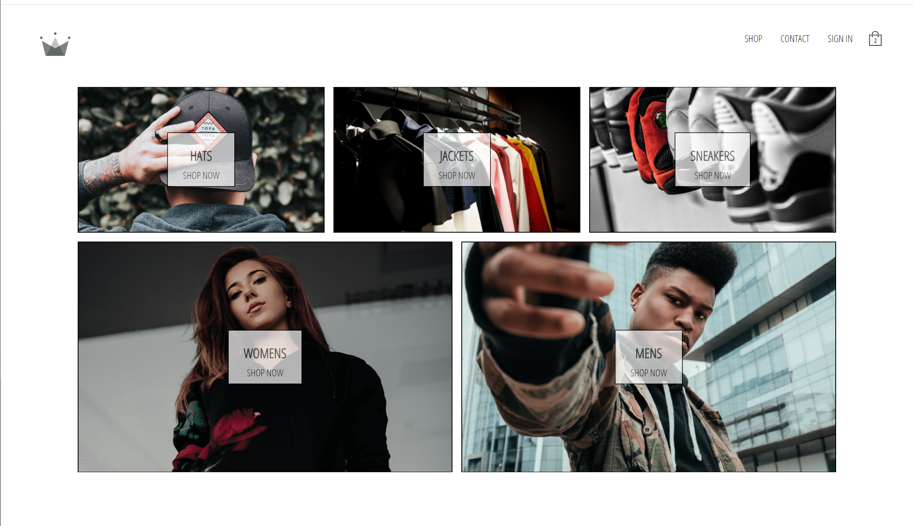
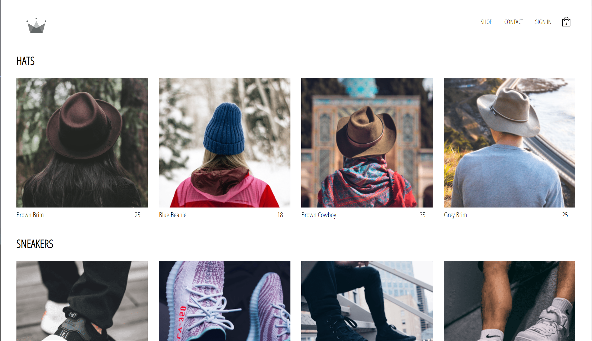
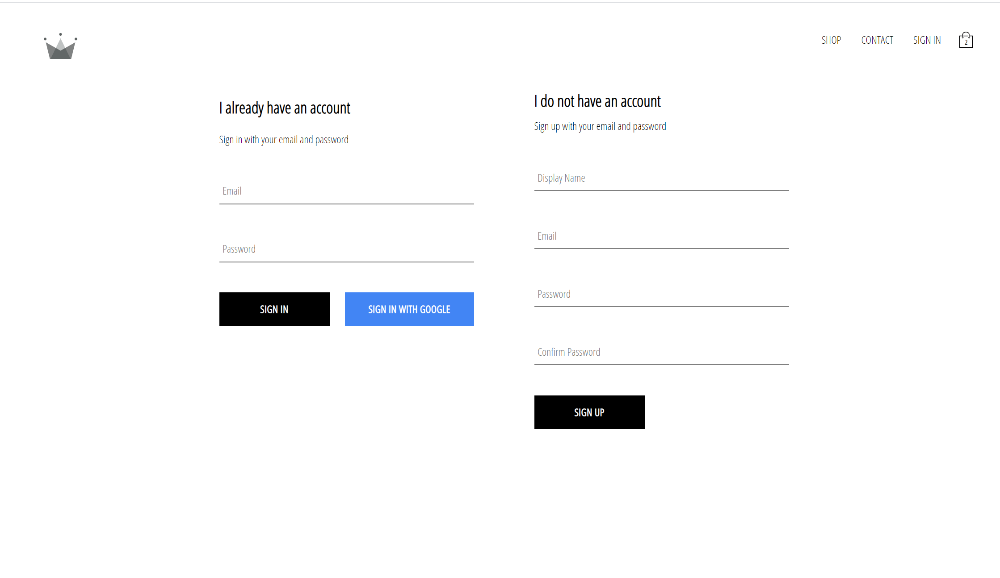
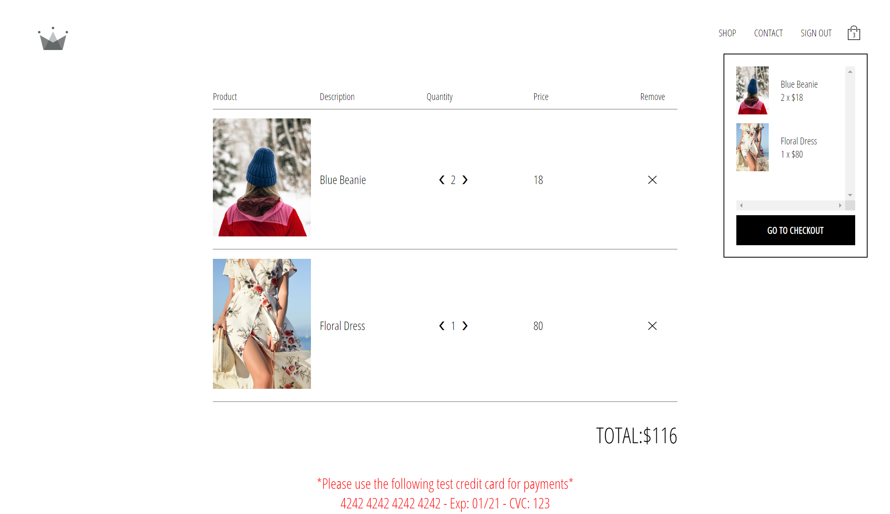
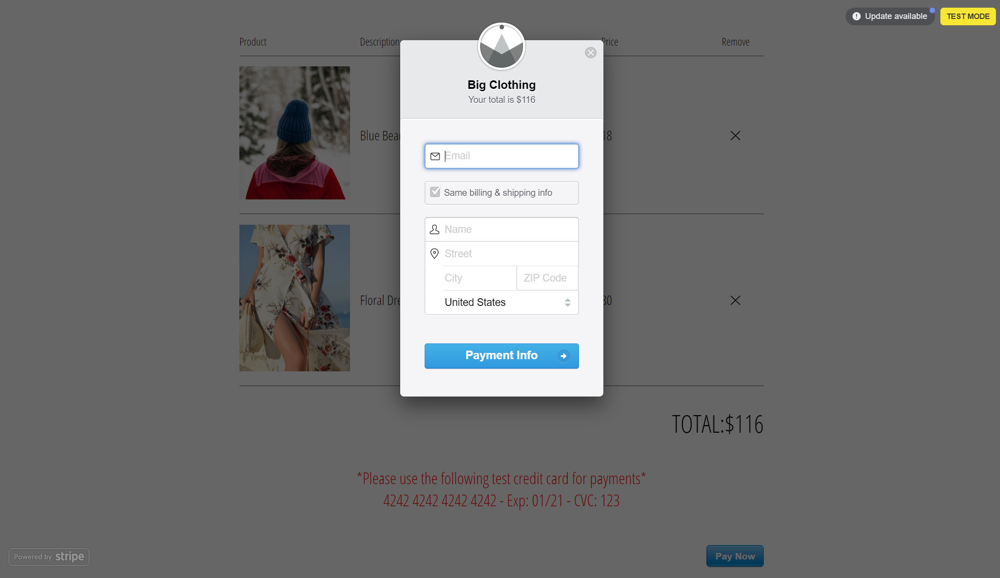

# Big Clothing - E-commerce App

Static Application that you can shop for the trendy styles of today!

## [Try it Yourself!](https://big-clothing.herokuapp.com/)

### Home Page

### Shop Page

### Sign Up Page

### Checkout Page

### Stripe Pop up

## Built With

* [SCSS](https://sass-lang.com/) - Front-End style library
* [JavaScript](https://developer.mozilla.org/en-US/docs/Web/javascript) - High level programming language
* [React.js](https://reactjs.org/) - MVC front-end framework 
* [Redux.js](https://redux.js.org/) - Library for React State management
* [Firebase](https://firebase.google.com) - Authentication platform - Database
* [Stripe](https://stripe.com) - Online payment system

## Planned Updates

Planned updates include, mobile platform, PWA integration, and GraphQL integration.